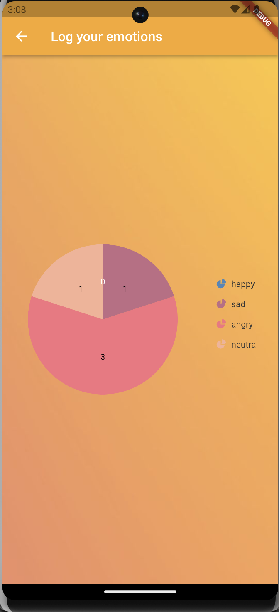

# Emotion Tracking App
A flutter app that allows you to plot track your emotions (happy, sad, neutral) on a calender and plot them on a pie chart.

## Usage

To run the app from the command line, open an emulator and run the following commands.
```bash
$ cd src
$ flutter run lib/main.dart
```



